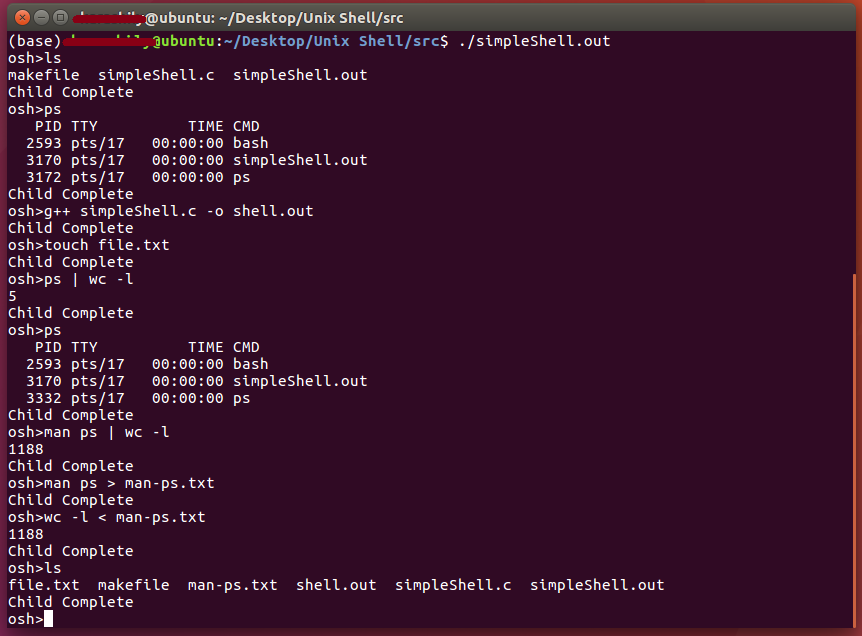

# Simple-Unix-Shell
a C program that serves as a UNIX shell interface and supports concurrency, input and output redirection and pipe communication.

<!-- TABLE OF CONTENTS -->
## Table of Contents

* [About the Project](#about-the-project)
  * [Built With](#built-with)
* [Getting Started](#getting-started)
  * [Prerequisites](#prerequisites)
  * [Installation](#installation)
* [Usage](#usage)
* [License](#license)


<!-- ABOUT THE PROJECT -->
## About The Project


This project consists of designing a C program to serve as a shell interface that accepts user commands and then executes each command in a separate process. The project is meant to support creating the child process and executing the command in the child, providing a history feature, adding support of input and output redirection, and allowing the parent and child processes to communicate via a pipe.



for more, check `docs/report.pdf`


### Built With
* C

<!-- GETTING STARTED -->
## Getting Started

### Prerequisites

* gcc
```sh
sudo apt-get install gcc
```

### Installation

1. Clone the repo
```sh
git clone https://github.com/HadeelMabrouk/Simple-Unix-Shell.git
```
2. Run makefile by typing
```sh
make
```


<!-- USAGE EXAMPLES -->
## Usage

1. Run the shell in the terminal
```sh
./simpleShell.out
```

2. type your UNIX command and it will run


<!-- LICENSE -->
## License

Distributed under the MIT License. See `LICENSE` for more information.
